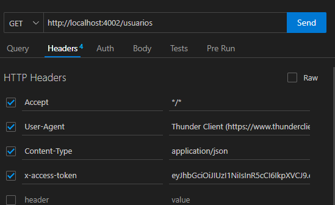

Esta api maneja todo lo relativo al Login

**iniciar la api: npm start

Agregar a cada llamado de la api los Headers. 

export function getUsers(){
    return async function (dispatch){
        let response = await axios.get("http://localhost:4002/usuarios", {
            headers: {'x-access-token': 'XXXX'}} );
        console.log(response.data)
        return dispatch({
            type: GET_USERS,
            payload: response.data
        })
    }
}

**Rutas :

GET: http://localhost:4002/usuarios 

POST: http://localhost:4002/usuarios 

        body: {
            "nombre":"Teresa",
            "usuario": "Kimoto",   **obligatorio y único**
            "email": "terek@gmail.com",  **obligatorio**
            "contrato":"87765",
            "password":"6654547",   **obligatorio*
            "rol": "Padre"   **obligatorio**
            }

GET by id: http://localhost:4002/usuarios/id

GET to Login: http://localhost:4002/usuarios/usuario/password

DELETE http://localhost:4002/usuarios/id

***Ruta para reseteo del password***

POST http://localhost:4002/reset

    body: { 
        "usuario": "xxx"
    }

PUT http://localhost:4002/usuarios

    body: { 
        "id" : "463"  //dato obligatorio
        "password": "8665545"
    }

    

Variable de entorno para el archivo .env

PORT='4002'
DB_USER ='postgres'
DB_NAME = 'postgres'
DB_PORT = '5433'
HOST = 'localhost'
DB_PASSWORD="xxxxx"
DB_HOST = 'localhost'

SECRET_KEY = 'palabra_secreta'

